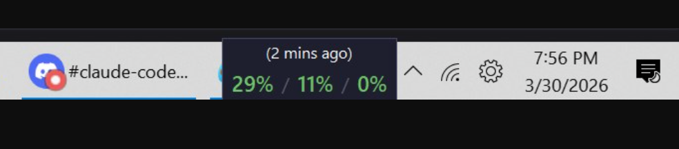
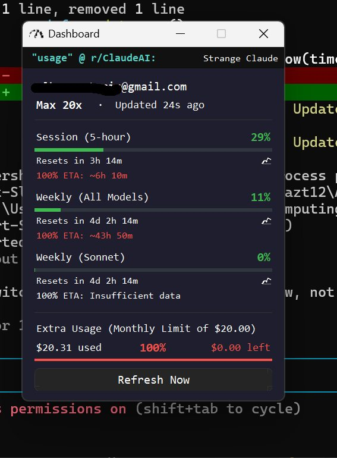
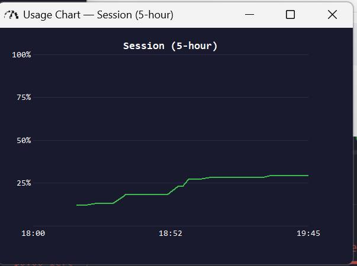

# Claude Code Usage Dashboard

A Windows taskbar widget that monitors your Claude Code API usage in real-time. See your session, weekly, and model-specific utilization at a glance without opening a browser.



## Features

**Taskbar Widget** — A small always-on-top overlay sits above your taskbar showing three usage percentages: session (5-hour), weekly (all models), and weekly (Sonnet). Color-coded green/yellow/red based on utilization level.



**Dashboard** — Click the widget to open a detailed breakdown:
- Session, weekly, and per-model usage with progress bars
- Reset countdown timers
- 100% ETA projections (estimates when you'll hit the limit at current pace)
- Extra Usage spending tracker with dollar amounts
- Reddit ticker pulling recent threads from r/ClaudeAI
- Live "Updated Xs ago" counter

**Usage Charts** — Click the chart icon next to any metric to open a full resizable chart window showing your utilization over time.



**Background Data Collector** — Optional headless daemon that polls usage every 10 minutes to build graph history, even when the widget GUI is closed. Enable in Settings. Does not cost tokens.

**Settings** — Three tabs:
- **General** — Startup, display scale, refresh interval
- **Customize** — Toggle metrics, depletion estimates, Reddit ticker
- **Colors** — Background and text color customization

## Requirements

- Windows 10/11
- Python 3.12+
- Claude Code CLI with an active subscription

## Install

```bash
pip install requests Pillow pystray comtypes
```

## Run

```bash
pythonw.exe claude_systray.py
```

Use `pythonw.exe` (not `python.exe`) for windowless operation — no console window.

## How It Works

The widget reads your Claude Code credentials from `~/.claude/.credentials.json` (created automatically when you log into Claude Code) and polls the Anthropic usage API at a configurable interval. No API key needed — it uses your existing subscription authentication.

## License

MIT
